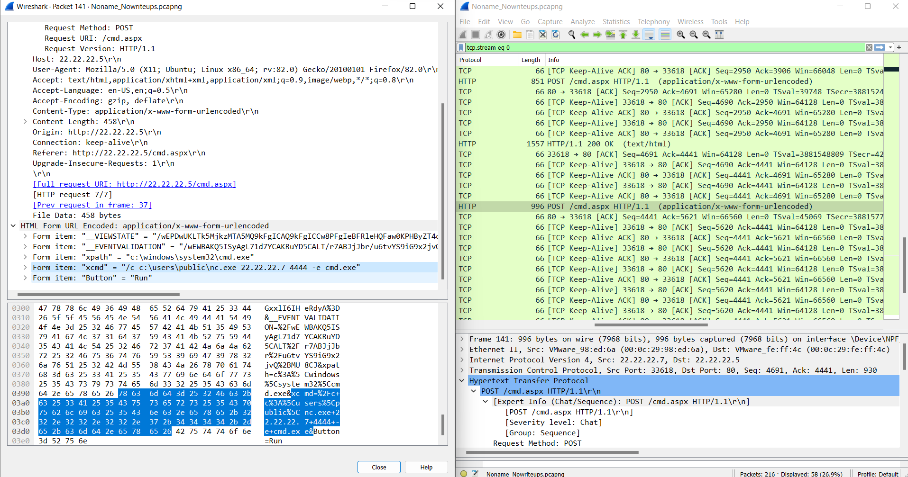
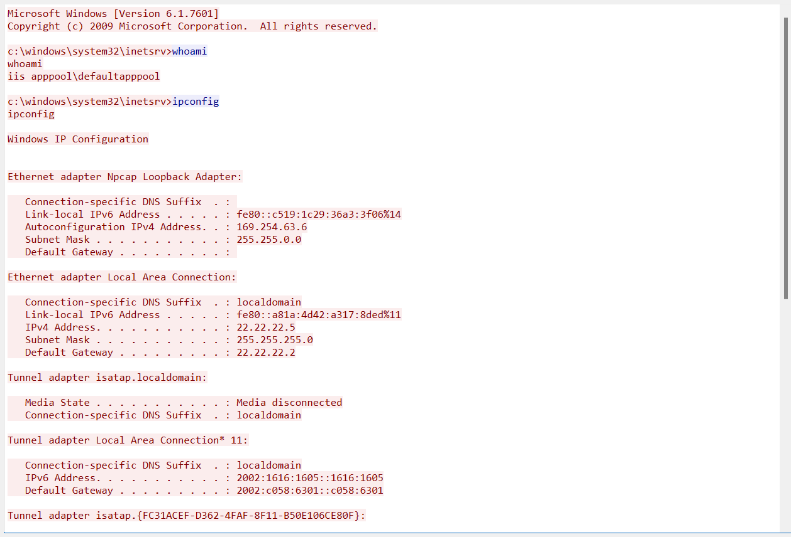

# NoName

## Tools :

-  [Wireshark](https://www.wireshark.org/download.html)
-  [CyberChef](https://gchq.github.io/CyberChef/)

------------------------------------------------------------------------------------------------

**Write (http) to filter packets this as in pictures**

and from packet no.4 you know server ip is (22.22.22.7)

then select this packet No.23 that has POST argument that source upload to server and do (follow HTTP steram) to show HTTP stream of this Packet

then you show this a milicious script that will run at server

then we will select another Packet used POST method in packet NO.141 

we select it and we will show device with ip (22.22.22.7) we post a file called nc.exe to server 

then we select packet NO.142 and use follow TCP Stream to show Content of it 

from Pictures we know the attacker was in server because using Command (whoami : to know the name of server & use ipconfig : to show ip of it )

the attacker switched the directory using (cd/)

then you show in above Picture attacker use ('powershell' to download a file with .txt extend but it give him an error then he use a 'certutil' command to download it)

then looking at follow TCP stream to a file with extend (.txt)

then we show a massage (heythere !) on it packet

we use cyberchef website to know the name of file 

we use (magic) to know file name magic recipe : it use to know which type name of file encoded wit it and decode it for you 

in picture we see it use (base 32) to encode name file (JBKEE62NIFXF6ODMOUZV6NZTMFGV6URQMNMH2IBA.txt)

and decode of it is (HTB{MAn_8lu3_73aM_R0cX})
